# OS Architecture and Hardware Interaction Diagrams

## Overall System Architecture

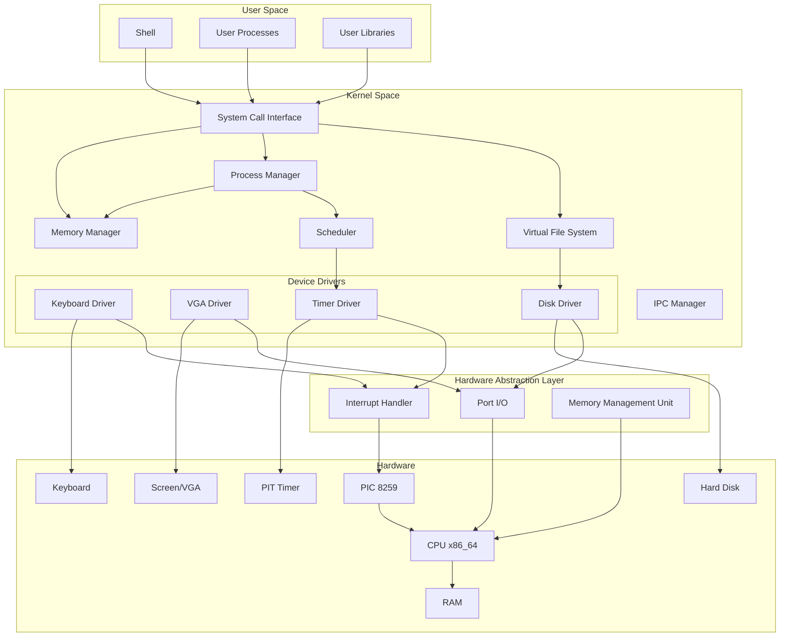

## Boot Process Flow

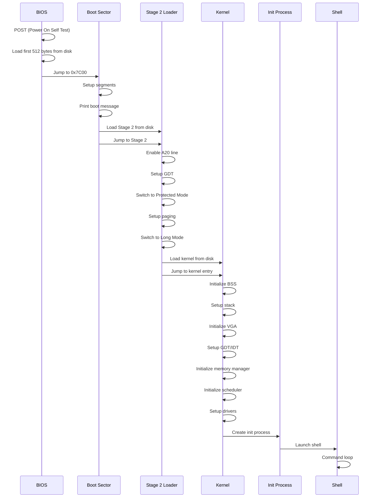

## Memory Layout

```mermaid
graph TB
    subgraph "Virtual Memory Layout (64-bit)"
        VM_KERNEL["0x0000000000000000 - 0x00000000FFFFFFFF<br/>Kernel Space (4GB)<br/>- Kernel Code<br/>- Kernel Data<br/>- Drivers<br/>- Page Tables"]
        VM_HEAP["0x0000000100000000 - 0x00000001FFFFFFFF<br/>Kernel Heap (4GB)"]
        VM_MMIO["0x0000000200000000 - 0x00000002FFFFFFFF<br/>Memory Mapped I/O (4GB)"]
        VM_USER["0x0000010000000000 - 0x00007FFFFFFFFFFF<br/>User Space<br/>- User Code<br/>- User Data<br/>- User Stack<br/>- User Heap"]
        VM_UNUSED["0x0000800000000000 - 0xFFFFFFFFFFFFFFFF<br/>Unused/Reserved"]
    end
    
    subgraph "Physical Memory Layout"
        PM_BIOS["0x00000000 - 0x000003FF<br/>IVT (1KB)"]
        PM_BDA["0x00000400 - 0x000004FF<br/>BIOS Data Area"]
        PM_FREE1["0x00000500 - 0x00007BFF<br/>Free (30KB)"]
        PM_BOOT["0x00007C00 - 0x00007DFF<br/>Boot Sector (512B)"]
        PM_STAGE2["0x00007E00 - 0x0009FFFF<br/>Stage 2 Loader"]
        PM_EBDA["0x000A0000 - 0x000BFFFF<br/>Video Memory (128KB)"]
        PM_BIOS_ROM["0x000C0000 - 0x000FFFFF<br/>BIOS ROM (256KB)"]
        PM_KERNEL["0x00100000 - 0x001FFFFF<br/>Kernel (1MB)"]
        PM_FREE2["0x00200000 - END<br/>Free RAM"]
    end
    
    VM_KERNEL -.->|"Maps to"| PM_KERNEL
    VM_USER -.->|"Maps to"| PM_FREE2
```

## Interrupt and System Call Flow

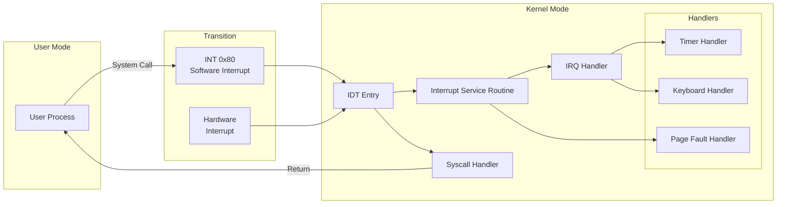

## Process State Machine

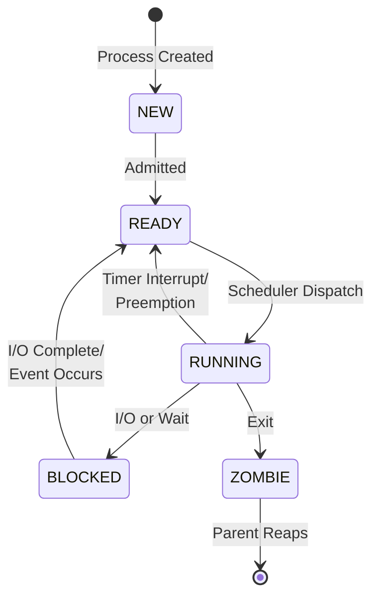

## Page Table Structure (4-Level Paging)

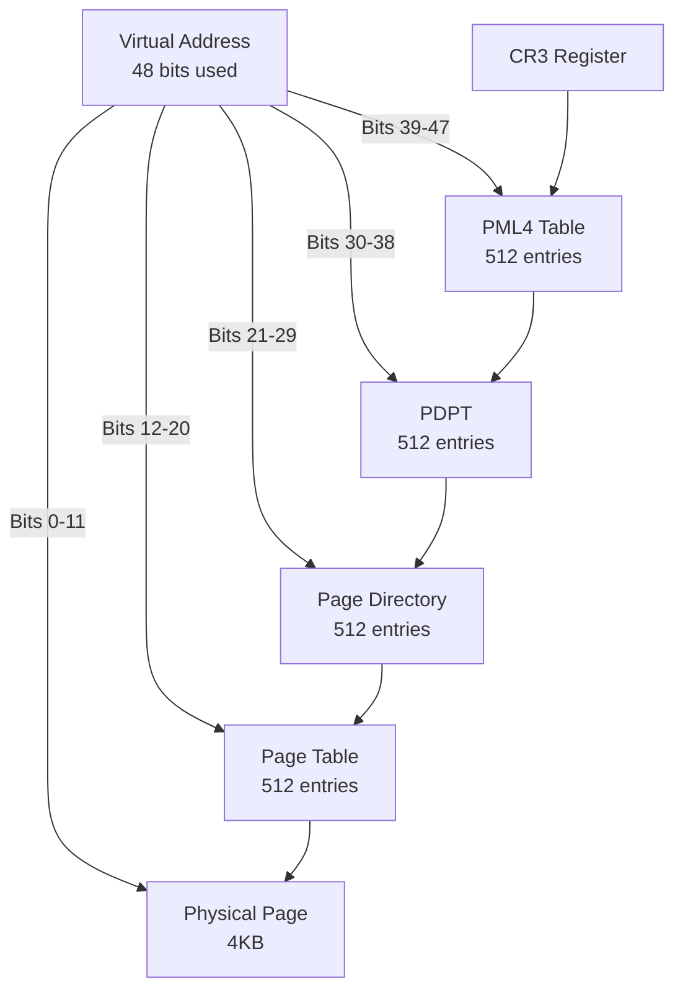

## Driver-Hardware Interaction

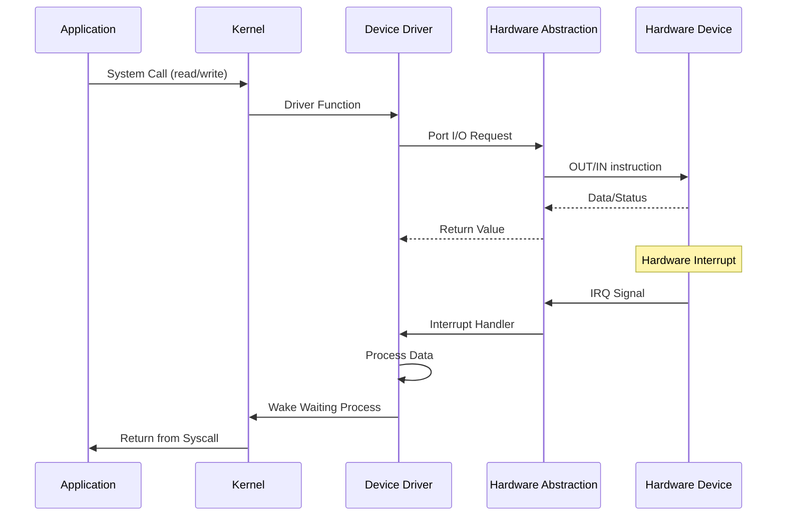

## Scheduler Algorithm (Round Robin)

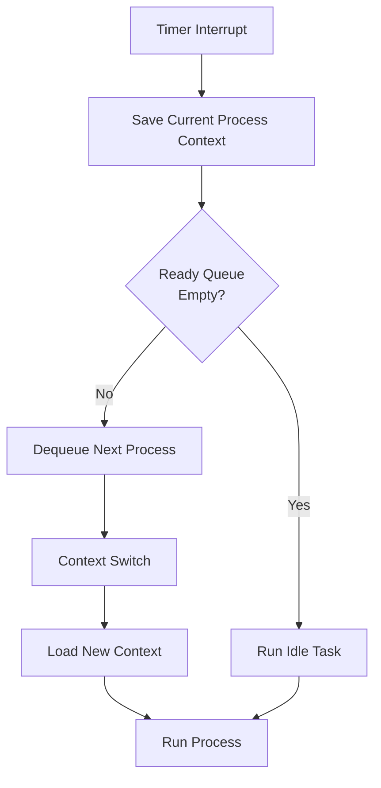

## Memory Allocation Strategy

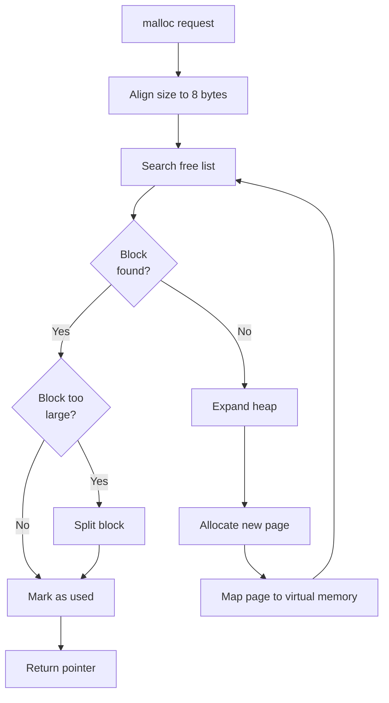

## I/O Port Communication

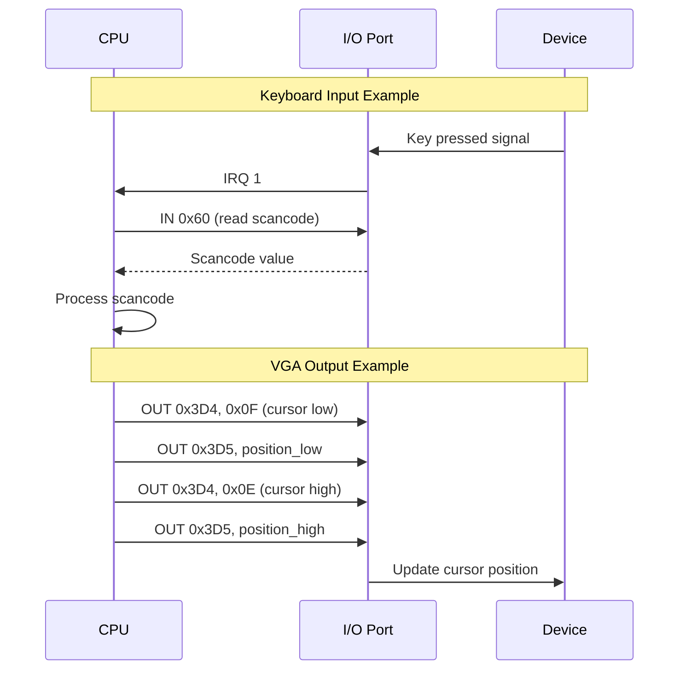

## Build Process Flow

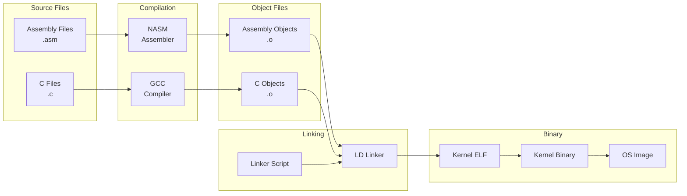

## System Call Mechanism

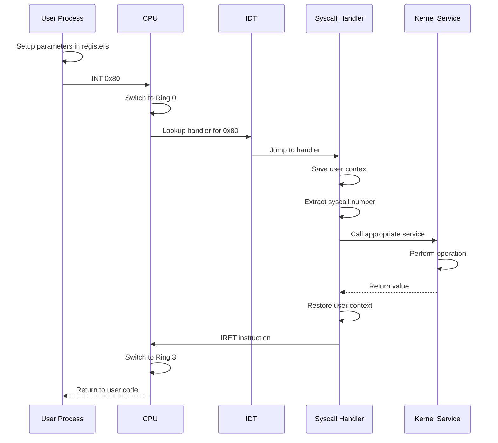

## CPU Mode Transitions

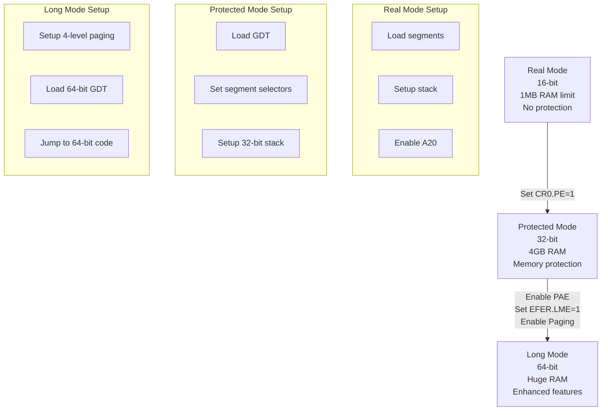

## Hardware Abstraction Layers

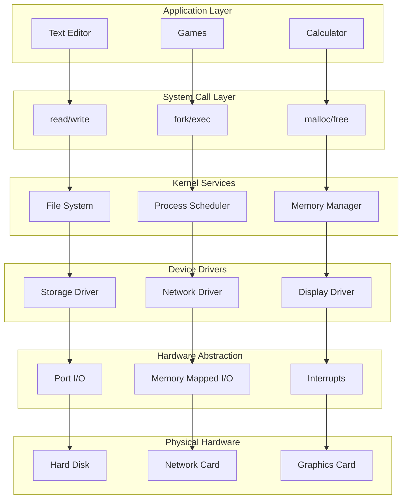

These diagrams provide a comprehensive visual representation of:
1. Overall system architecture and component relationships
2. Boot process sequence
3. Memory organization (virtual and physical)
4. Interrupt and system call flow
5. Process state transitions
6. Page table structure for virtual memory
7. Driver-hardware communication
8. Scheduler operation
9. Memory allocation strategy
10. I/O port communication
11. Build process
12. System call mechanism
13. CPU mode transitions
14. Hardware abstraction layers

Each diagram shows how different parts of our OS will interact with the hardware and with each other, providing clear visualization of the complex relationships in our operating system.